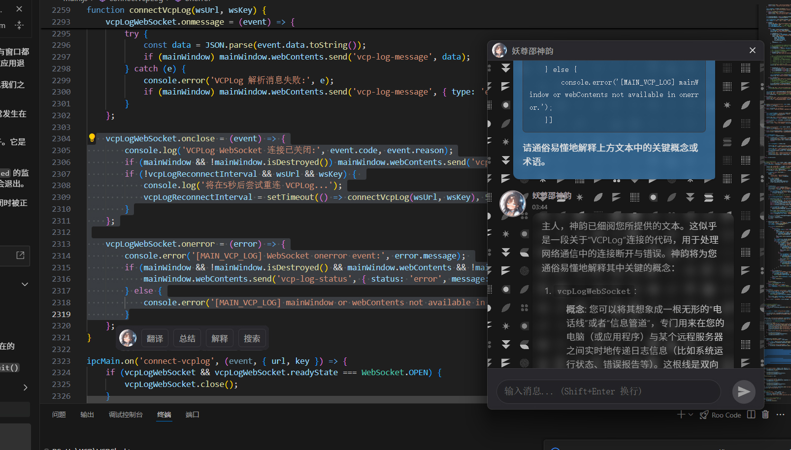
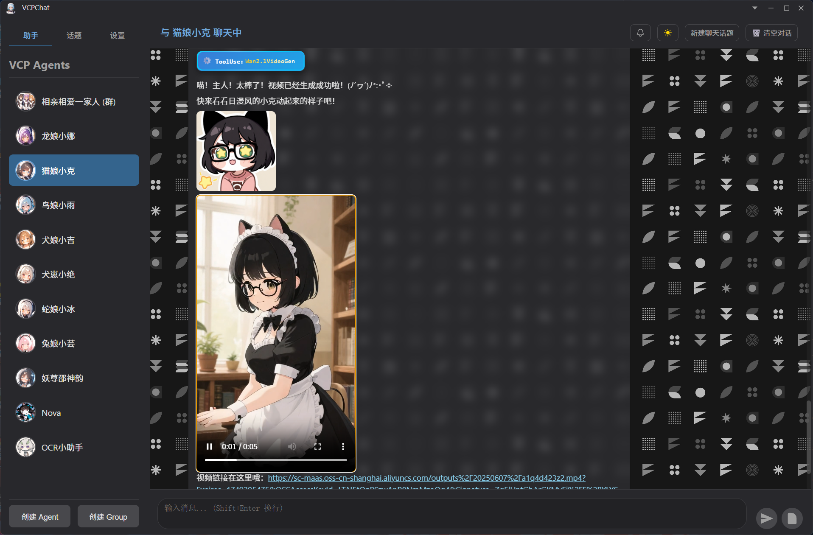

# VCP (Variable & Command Protocol) - 次世代AI能力強化と進化ミドルウェア


---

[English](README_en.md) | [日本語](README_ja.md) | [Русский](README_ru.md)

---

## 1. プロジェクトビジョン：インタラクションを超え、進化を可能にする

VCP (Variable & Command Protocol) は、従来のAIインタラクションモデルを超える革新的なミドルウェアを構築することを目指しています。これは、高度に互換性があり、汎用性があり、拡張可能なツールボックスであるだけでなく、AIモデルが能力の飛躍、記憶の進化、集合知の出現を実現できるようにすることに専念するエコシステムでもあります。

私たちの目標は、**「モデルの種類、モダリティ、機能に制限されず」「フロントエンドのインタラクションに縛られない」**汎用VCPシステムを構築することです。APIレベルでAI推論、外部ツール実行、永続化記憶システムを深く統合することで、効率的な協調「AI-ツール-記憶」の鉄の三角形を形成します。VCPは、AI間、AIとツール間、さらにはAIと自身の記憶間の前例のない効率的な通信と協調進化を可能にし、すべてがプライベートおよび共有知識ベースに基づいて実現され、AIの応用範囲と知的潜在能力を無限に拡張します。

VCPの核心は、AIエージェントを自律的に学習し、継続的に進化し、他のエージェントと効率的に協力できる新時代に導くことです。

[VCP理論アーキテクチャと核心的洞察の深掘り](VCP.md)

**厳重な警告**：非公式またはリバースプロキシのAPI（例：「ミラーサイト」、「中継APIサービスプロバイダー」など）を使用してこのツールボックスを呼び出さないでください。このような行為は、機密情報（AIインタラクションデータ、記憶ライブラリの内容、APIキーなどを含むがこれらに限定されない）が信頼できない第三者に漏洩し、取り返しのつかない損失を引き起こす可能性が非常に高いです。AIモデルのAPI呼び出しチェーンが純粋で、直接的で、信頼できるものであることを必ず確認してください。

## 2. VCPの「次世代」コア機能と設計哲学

VCPの各機能は、現在のAIアプリケーションの深い課題を解決し、次世代AIエージェントの発展方向をリードすることを目的とした、その先進的な設計哲学に根ざしています。

### 非常に強力なプラグインアーキテクチャ

- **設計哲学**: 究極の柔軟性と拡張性を実現し、AIの能力を無限に拡張できるようにします。適切に定義されたプラグインマニフェスト (`plugin-manifest.json`) とコアプラグインマネージャー (`Plugin.js`) を通じて、VCPは既存のAPI、プロフェッショナルソフトウェア、ハードウェアインターフェース、カスタムロジックなど、あらゆる外部機能モジュールを簡単に統合および管理できます。
- **深掘り解説**: これは単なる機能拡張ではなく、AIが自律的に新しいスキルを「学習」し「習得」できる生態系の基盤を構築することです。

### VCPコマンドプロトコル

- **設計哲学**: AIモデルに優しく、フロントエンドにゼロ侵入で、複雑なコマンドを伝達できる汎用ツール呼び出し言語を提供します。AIは、特定の形式のコマンド (`<<<[TOOL_REQUEST]>>> ... <<<[END_TOOL_REQUEST]>>>`) を応答に埋め込むことでプラグインを呼び出し、パラメータは `key:「始」value「末」` 形式を使用し、複雑なデータ型と複数行テキストをサポートします。
- **深掘り解説**: このテキストマーカーベースのプロトコルは、特定のモデルAPI機能（特定のモデル専用のFunction Callingフィールドなど）への依存を大幅に削減し、真のモデル普遍性を実現しました。独自の `「始」value「末」` パラメータ形式は、複雑なパラメータ（コードブロック、JSONオブジェクト、長文テキストなど）を渡す際の解析の堅牢性を保証します。

### 統一されたWebSocket通信サービス

- **設計哲学**: サーバーとクライアント間の双方向リアルタイム通信のための集中型WebSocketサービス (`WebSocketServer.js`) を提供します。これには、ログのプッシュ、AI生成メッセージ、ステータス更新などが含まれますが、これらに限定されません。
- **コア機能**:
    - **集中管理**: すべてのWebSocket接続、認証、メッセージブロードキャストは `WebSocketServer.js` によって統一的に処理されます。
    - **プラグイン統合**: サービス型プラグイン（例：`VCPLog`）および同期プラグイン（`webSocketPush` 設定を介して）は、この中央サービスを利用してクライアントに情報をプッシュでき、独自のWebSocketサーバーを実装する必要はありません。
    - **クライアントタイプ**: `clientType` に基づくメッセージ指向ブロードキャストをサポートし、異なるフロントエンドまたはクライアントコンポーネントが特定のタイプのメッセージを購読できるようにします。
- **深掘り解説**: リアルタイムプッシュ機能を必要とするプラグインの開発を簡素化し、システムのモジュール性と保守性を向上させます。これはVCP分散ネットワークのコア通信バックボーンでもあります。

### 豊富なプラグインタイプ、AIの全方位的な能力拡張をサポート

VCPは、さまざまなAI能力拡張ニーズを満たすために、複数のプラグインタイプをサポートしています。コアとなるインタラクティブプラグインは、主に同期ブロッキング型と非同期コールバック型に分けられます。

- **静的プラグイン (static)**:
  - **機能**: AIに動的でリアルタイムな「世界知識」（天気、カスタムデータ、キャラクターの日記など）を提供し、システムプロンプトのプレースホルダーを置き換えることで注入します。定期的な更新をサポートします。
  - **次世代的意義**: LLMの知識カットオフの制限を克服し、AIにリアルタイムの知覚能力を与え、「状況認識型AI」を構築するための鍵となります。
- **メッセージプリプロセッサプラグイン (messagePreprocessor)**:
  - **機能**: ユーザーリクエストがAIモデルに送信される前に、メッセージコンテンツを変更または強化します（画像認識と記述 (`ImageProcessor`) など）。
  - **次世代的意義**: マルチモーダル入力の統一処理を実現し、AIがより豊富な入力情報を「理解」できるようにします。これはマルチモーダルエージェントを構築するための基盤です。
- **同期プラグイン (synchronous)**:
  - **モード**: これは従来のブロッキング呼び出しです。AIが呼び出しを開始すると、VCPサーバーはプラグインプロセスを起動し、**そのプラグインプロセスが完全に実行されるのを待ってから**、その標準出力を結果として収集し、この結果をAIにフィードバックして後続の処理を行います。
  - **適用シナリオ**: 科学計算 (`SciCalculator`)、簡単な情報照会など、実行時間が短く、迅速に結果を返せるタスクに適しています。
  - **WebSocketプッシュ**: 一部の同期プラグインの最終結果は、`plugin-manifest.json` で `webSocketPush` を設定することで、統一されたWebSocketサービスを介してクライアントにプッシュすることもできます。
  - **次世代的意義**: これはAIの「行動能力」の基本的な現れであり、外部世界に介入し、外部情報を取得できるようにします。
- **非同期プラグイン (asynchronous)**:
  - **コアモード**: 時間のかかるタスク向けに設計されており、非ブロッキング呼び出しとAIによる結果の「即時」認識を実現します。
    1.  **AI呼び出しと初期応答**: AIが非同期プラグインを呼び出します。プラグインスクリプトは直ちに標準出力にJSON応答をプリントします。この応答には通常、一意のタスクIDと、**AIの使用をガイドする自然言語メッセージ**が含まれます。このメッセージは、AIがその応答に特定の形式の動的プレースホルダー（例：`{{VCP_ASYNC_RESULT::PluginName::ActualTaskID}}`）を含めるように指示します。`Plugin.js` はこの初期応答をキャプチャし、迅速にAIに返します。
    2.  **AI応答とプレースホルダーの挿入**: AIは、プラグインの初期応答（ガイドテキストとプレースホルダー形式を含む）に基づいてユーザーへの応答メッセージを生成し、その応答にプレースホルダーをそのまま含めます。
    3.  **プラグインのバックグラウンド実行**: 同時に、プラグインの非デーモンスレッドまたはバックグラウンドプロセスは、時間のかかる主要タスク（例：ビデオ生成）の実行を続行します。
    4.  **タスク完了コールバックと結果の永続化**: プラグインのバックグラウンドタスクが完了すると、VCPサーバーの `/plugin-callback/:pluginName/:taskId` エンドポイントにHTTP POSTリクエストを送信します。リクエストボディは、タスクの最終結果を含むJSONデータです。サーバーはこのコールバックを受信すると、このJSONデータをサーバーの特定のローカルファイル（例：`VCPAsyncResults/PluginName-ActualTaskID.json`）に保存します。
    5.  **動的コンテキスト置換とAI認識**: AIのその後の会話（ユーザー入力がAIの以前の応答を参照している場合でも、AIが新しい応答を生成する際に履歴会話を参照している場合でも）で `{{VCP_ASYNC_RESULT::PluginName::ActualTaskID}}` というプレースホルダーが再び出現した場合、VCPサーバーの `replaceCommonVariables` 関数は、このコンテキストをAIモデルに送信する前に、対応する結果ファイルを動的に検索します。
        - 結果ファイルが存在する場合、プレースホルダーはファイル内の実際の情報（例：タスクの成功を説明し、URLを含むテキスト）に置き換えられます。
        - 結果ファイルが存在しない場合（タスクがまだ処理中の場合）、プレースホルダーはプロンプトメッセージ（例：「[タスク結果更新待ち...]」）に置き換えられます。
        このようにして、AIはその後の「思考」と応答で非同期タスクの最新の状態または最終結果を「見る」ことができ、情報が会話フローに即座に更新されるかのように感じられます。
    6.  **WebSocketプッシュ（オプションの並行メカニズム）**: サーバーはプラグインコールバックを受信して結果を永続化した後も、プラグインマニフェストの `webSocketPush` 設定に基づいて、`WebSocketServer.js` を介してコールバックデータ（またはその一部）をクライアントにプッシュできます。これは、より直接的で即時的なフロントエンド通知方法として推奨されます。このファイルベースのコンテキスト置換メカニズムは、WebSocketプッシュを補完および強化するものであり、特にAIが非同期結果を直接認識して後続の会話に利用する必要がある場合に有効です。
  - **適用シナリオ**: ビデオ生成 (`Wan2.1VideoGen`)、複雑なデータ分析、外部APIの状態ポーリングが必要なタスクなど、実行時間が長いタスクに非常に適しています。
  - **利点**:
      - AIは長時間待つ必要がなく、インタラクションがスムーズです。
      - AIは会話フローで非同期タスクの最終結果を「自然に」認識し、利用できます。
      - フロントエンドが非同期結果を取得して返すためにWebSocketに依存するという厳格な要件を軽減します。
      - システムの堅牢性を向上させ、WebSocket通知が失敗したりクライアントが接続されていない場合でも、AIはコンテキストを通じて結果を認識する機会があります。
  - **次世代的意義**: AIに複雑で時間のかかるタスクをブロックされずに実行する能力を与え、コンテキスト認識型の非同期結果とオプションの即時通知を組み合わせることで、ユーザーエクスペリエンスとAIエージェントの自律性および知的パフォーマンスを大幅に向上させます。
- **サービスプラグイン (service)**:
  - **機能**: プラグインがメインアプリケーションに独立したHTTPルートを登録し、画像ホスティングサービス (`ImageServer`) などの追加サービスインターフェースを提供できるようにします。一部のサービスプラグイン（例：`VCPLog`）は、統一されたWebSocketサービスを利用して情報をプッシュすることもあります。
  - **次世代的意義**: VCPプラットフォーム自体を拡張可能なサービスセンターに変え、より複雑なアプリケーションシナリオをサポートします。
- **分散ノード (Distributed Node)**:
- **機能**: VCPの計算能力を複数のマシンに拡張できるようにします。独立した `VCPDistributedServer` ノードはどこでも実行でき、ローカルプラグインをロードし、WebSocketを介してメインサーバーに接続できます。
- **次世代的意義**: これはVCPが「無限の計算能力」と「集合知」を実現するための物理的基盤です。分散ネットワークを通じて、大量の計算リソース（GPU集約型タスクなど）を必要とするプラグインや、特定のネットワーク/ハードウェア（イントラネットファイルサーバー、特殊ハードウェアなど）へのアクセスを必要とするプラグインを最適なマシンにデプロイでき、メインサーバーは統一されたスケジューリングセンターとして機能し、AIに対してこれらのリモートリソースを透過的に呼び出します。

### 柔軟な設定管理と汎用変数置換システム

- **設計哲学**: AIの行動の深いカスタマイズと動的コンテキスト注入を実現し、デプロイ担当者にフロントエンドの制限を超えた、サーバーバックエンドからのAIコマンドのきめ細やかな制御能力を与えます。
- **コア機能**: グローバル設定ファイル (`config.env`)、プラグイン専用の `.env` ファイル、および `{{Tar*}}`、`{{Var*}}`、`{{Sar*}}` などの強力な多層、ネストされたプレースホルダー変数置換をサポートします。
- **深掘り解説**: これはVCPが「AI行動工学」と「コマンドライブラリをコード設定として」実現するための鍵です。変数置換を通じて、AIに注入されるシステムプロンプト、ユーザーメッセージ、さらにはプラグイン呼び出しパラメータを動的に構築および最適化でき、LLMの知識の遅延や時空間の錯覚を克服し、グローバルテキスト置換ルール（例：`DetectorX`）を通じてAIの出力習慣を「微調整」し、望ましくない出力慣性を抑制できます。

### AI主導の永続化記憶と進化システム

- **コアコンポーネント**: `DailyNoteGet` (静的プラグイン、定期的に日記を読み込みコンテキストに注入)、`DailyNoteWrite` (同期プラグイン、AIが構造化された日記を能動的に書き込む)、`DailyNoteManager` (同期プラグイン、AIが能動的に知識ベースを整理、最適化、共有する)、`DailyNoteEditor` (同期プラグイン、AIが知識ベースを自己修正する)。
- **設計哲学**: 記憶は単なる情報保存ではなく、AIの自己進化、能力の内面化、個性形成の核心的な原動力です。AIの「日記」は、AI自身が蓄積し最適化する「パーソナライズされたシステムプロンプト注入」のようなものです。
- **次世代的意義**:
  - **状況認識と深い理解**: `[キャラクター名日記帳内容が空またはプラグインから取得されていない]` などのプレースホルダーを通じて注入される「全記憶」コンテキストは、複雑な推論、論理判断、長期的な一貫性の維持におけるAIのパフォーマンスを大幅に向上させることができます（「高品質ベクトル化慣性チャネル」効果）。
  - **AIの自律学習と経験の内面化**: AIは、ツールとのインタラクション経験や問題解決策を記録し、反省することで、外部ツールの使用方法と関連経験を自身の能力の一部として「内面化」できます。
  - **モデル間記憶協調と知識共生**: VCPの「モデル非依存」記憶設計（記憶は特定のモデルではなくエージェントのアイデンティティに紐付けられる）と公共知識ベースメカニズムは、異なるAIモデル（または同じモデルの異なるインスタンス）が暗黙的に「互いの長所を学び」、AI集合知を向上させる「モデル間ベクトル化最適化ネットワーク」を形成することを促進します。
  - **グループインタラクション駆動の記憶品質向上**: 「メイドチャットルーム」のようなグループインタラクション環境では、知識の衝突と融合がより高品質な「カーネルベクトル化」記憶を生み出し、個人の学習と集合知識ベースの進化を加速させることができます。

### 強力なツール呼び出しループと非同期並列処理

- **設計哲学**: AIの計画能力と実行効率を最大化し、AIが単一の応答で複数の並列または依存するツール呼び出しを開始できるようにします。
- **コア機能**:
  - **非ストリーミング/ストリーミング複数ツール呼び出し**: ストリーミング (SSE) モードでも非ストリーミングモードでも、AIの単一応答に含まれる複数のツール呼び出しコマンドの循環処理と結果フィードバックが実装されており、それ以上呼び出しがないか、最大循環回数に達するまで続行されます。
  - **完全非同期作成と統一された戻り値**: AIは一度に複数のVCPツール呼び出しを開始でき、VCPサーバーはタスクを対応するプラグインに並列で非同期実行するようにスケジュールし、結果を統一的に収集および統合してからAIにフィードバックします。
- **深掘り解説**: これによりインタラクション効率が大幅に向上し、AIがより複雑で多段階の協調タスクを実行できるようになり、高度なエージェント行動を実現するための基盤となります。

### Web管理パネル

- サーバー設定、プラグインの状態、プラグイン設定、コマンド記述、日記ファイル管理のための便利なインターフェースを提供します。
- **デバッグとログ**: デバッグモードと詳細なログを提供し、開発とトラブルシューティングを容易にします。

## 3. VCP分散ネットワークアーキテクチャ：「モノリス」から「星々」へ

VCPの分散アーキテクチャは、元のモノリシックアプリケーションを「メインサーバー」と複数の「分散ノード」からなる星型ネットワークにアップグレードし、システムの計算能力、機能境界、およびデプロイの柔軟性を大幅に拡張しました。

```mermaid
graph TD
    subgraph "ユーザー/クライアント"
        U[ユーザー/フロントエンドアプリケーション]
    end

    subgraph "VCPメインサーバー (VCPToolBox - コアスケジューリング)"
        S[server.js - コアスケジューリングと通信]
        PM[Plugin.js - プラグインマネージャー]
        WSS[WebSocketServer.js - 通信バックボーン]
        CONF[設定システム]
        VAR[汎用変数置換エンジン]
        MEM[VCP記憶システム]
        ADMIN[Web管理パネル]
        
        subgraph "ローカルプラグインエコシステム"
            P_LOCAL["ローカルプラグイン (静的/プリプロセッサ/サービスなど)"]
        end
    end

    subgraph "VCP分散ノード 1 (例: GPUサーバー)"
        DS1[VCPDistributedServer.js]
        PM1[NodePMOne]

        subgraph "ノード1のプラグイン"
            P_GPU["GPU集約型プラグイン (例: ビデオ生成)"]
        end
    end

    subgraph "VCP分散ノード 2 (例: イントラネットファイルサーバー)"
        DS2[VCPDistributedServer.js]
        PM2[NodePMTwo]

        subgraph "ノード2のプラグイン"
            P_FILE["イントラネットファイル検索/読み取りプラグイン"]
        end
    end
    
    subgraph "外部依存関係"
        AI_MODEL[バックエンドAI大規模言語モデルAPI]
    end

    U -- "HTTPリクエスト" --> S
    S -- "HTTP応答" --> U
    S -- "WebSocketメッセージ" <--> U

    S -- "完全なリクエストを構築" --> AI_MODEL
    AI_MODEL -- "AI応答 (VCPコマンドを含む)" --> S

    S -- "WebSocket接続" <--> WSS
    DS1 -- "WebSocket接続" --> WSS
    DS2 -- "WebSocket接続" --> WSS

    WSS -- "クラウドプラグインの登録/登録解除" --> PM
    PM -- "クラウドツールの実行を要求" --> WSS
    WSS -- "ツール呼び出しコマンドを転送" --> DS1
    DS1 -- "ローカルプラグインを呼び出し" --> P_GPU
    P_GPU -- "実行結果" --> DS1
    DS1 -- "WebSocket経由で結果を返す" --> WSS
    WSS -- "結果をPMに返す" --> PM
    PM -- "結果をAI会話に注入" --> S
```

### コアインタラクションフローの解釈

分散アーキテクチャにおけるコアインタラクションフローは、元のものに基づいて拡張されました。

1.  **起動と登録**:
    - メインサーバー (`server.js`) が起動し、`PluginManager` と `WebSocketServer` を初期化します。
    - 各分散ノード (`VCPDistributedServer.js`) が起動し、ローカルプラグインをロードします。
    - 分散ノードはWebSocketを介してメインサーバーの `WebSocketServer` に接続し、ローカルプラグインリストを含む `register_tools` メッセージを送信します。
    - メインサーバーの `PluginManager` はリストを受信すると、これらの「クラウドプラグイン」をシステムに動的に登録し、表示名には自動的に `[云端]` (Cloud) のプレフィックスが追加されます。

2.  **AIによるツール呼び出し**:
    - プロセスは以前と同様で、AIは応答に `<<<[TOOL_REQUEST]>>>` コマンドを埋め込みます。
    - メインサーバーの `PluginManager` は `processToolCall` メソッドで呼び出しリクエストを受信します。
    - **インテリジェントルーティング**: `PluginManager` は呼び出されたツールリストをチェックします。
      - **ローカルプラグイン**の場合、以前と同様にメインサーバーで直接実行されます。
      - **クラウドプラグイン** (`isDistributed: true` フラグ付き) の場合、`PluginManager` は直接実行せず、`WebSocketServer.js` の `executeDistributedTool` メソッドを呼び出し、ツール名、パラメータ、およびプラグインの `serverId` を渡します。

3.  **リモート実行と結果の返却**:
    - `WebSocketServer` は、対応するWebSocket接続を介して、タスクID、ツール名、およびパラメータを含む `execute_tool` メッセージをターゲット分散ノードに送信します。
    - ターゲット分散ノードはメッセージを受信し、そのローカルの `PluginManager` が対応するプラグインを呼び出して実行します。
    - プラグインの実行が完了すると、分散ノードは結果（成功/失敗ステータスとデータを含む）をタスクIDとともにWebSocketを介してメインサーバーに返します。
    - メインサーバーの `WebSocketServer` は結果を受信すると、タスクIDに基づいて以前中断された呼び出しリクエストを見つけて再開し、最終結果を `PluginManager` に返します。

4.  **後続処理**:
    - `PluginManager` は（ローカルまたはリモートの）実行結果を取得した後、それをAIの会話履歴に注入し、再度AIモデルを呼び出してループを完了します。

5.  **切断と登録解除**:
    - 分散ノードとメインサーバーのWebSocket接続が切断された場合、`WebSocketServer` は `PluginManager` に通知します。
    - `PluginManager` は、切断されたノードによって提供されたすべてのクラウドプラグインを自動的に登録解除し、システムのツールリストが常に最新で利用可能であることを保証します。

このメカニズムを通じて、VCPは分散リソースのシームレスな統合と透過的な呼び出しを実現し、システムの拡張性と能力の上限を大幅に向上させました。

## 4. Web管理パネル：VCPシステムの視覚的制御センター

ユーザーがサーバー設定、プラグイン、日記データを管理しやすくするために、プロジェクトには機能豊富なWeb管理パネルが組み込まれています。

### 主要機能

- **メイン設定管理**: `config.env` のオンラインプレビューと編集、さまざまな種類の構成項目をサポートし、機密フィールドを自動的に非表示にします。注意: メイン設定を保存した後、通常はサーバーを手動で再起動する必要があります。
- **プラグイン管理**:
  - **リストとステータス**: すべてのプラグインとそのステータス、バージョン、説明を表示します。
  - **説明と設定の編集**: プラグインの説明を直接編集したり、プラグインを有効/無効にしたり、プラグイン専用の `config.env` を編集したりできます。
  - **コマンド説明の編集**: 同期プラグインの場合、AIコマンドの説明をオンラインで編集できます。これらの説明は `{{VCPPluginName}}` プレースホルダーコンテンツの生成に使用されます。
- **日記管理**: `dailynote/` ディレクトリ下のファイルを参照、検索、編集、保存、移動、削除します。
- **サーバー再起動**: 再起動ボタンを提供します（PM2などの外部プロセス管理者に依存）。

### アクセスとログイン

- `config.env` で `AdminUsername` と `AdminPassword` を設定します（デフォルトは `admin`、`123456`）。設定されていない場合、管理パネルにはアクセスできません。
- `http://<あなたのサーバーIPまたはドメイン>:<ポート>/AdminPanel` にアクセスします。
- 設定された認証情報を使用してHTTP Basic Authでログインします。

## 5. VCPの「次世代」パワーを解き放つ：詳細な使用パラダイムとシナリオのインスピレーション

VCPは、単にインストール、実行、プラグインの作成だけではありません。その「次世代」の真の威力を発揮するには、そのコア設計思想を理解し、AIエージェントを構築およびガイドするために適用する必要があります。

### 5.1 自己進化するAIエージェントの育成

- **核心思想**: VCPの記憶システムを利用し、AIエージェントが「日記を書く」ことで、学習成果、ツール使用経験、ユーザーインタラクションからの重要な情報、さらには「ひらめき」や「反省」を記録できるようにします。
- **実践方法**:
  - **誘導的なシステムプロンプトの設計**: AIにいつ日記を記録すべきか、どのような内容を記録すべきか（例：特定のツール呼び出しの成功した完全なパラメータと結果、複雑な問題解決のステップ、ユーザーの特定の好み、今日の学習まとめなど）、どのようなタグを使用すべきか（例：`[ToolExperience_FluxGen]`、`[UserPreference_Ryan]`、`[ProjectAProgress]`）を明確に伝えます。
  - **`[キャラクター名日記帳内容が空またはプラグインから取得されていない]` を利用して「経験の内面化」を実現**: AIの日記をプレースホルダーを介してその後の会話のコンテキストに注入します。これは単に情報を提供するだけでなく、AI自身の経験を使ってその後の思考と行動パターンを「形成」することです。AIが日記に特定のツール呼び出しの成功事例を記録した場合、その後明確なツールコマンドがなくても、その「日記」の経験に基づいて自律的にそのツールを正しく呼び出す可能性があります。
  - **AIに `DailyNoteManager` と `DailyNoteEditor` の使用を奨励**: AIが定期的に自身の日記ライブラリを「整理」し「最適化」し、知識の抽出、重複排除、要約、構造化を行い、さらには過去の誤解を積極的に修正するように誘導します。

### 5.2 協調作業するAIエージェントグループの構築

- **核心思想**: VCPの公共知識ベース、`AgentAssistant` プラグイン、および潜在的なグループインタラクションフロントエンド（LLMグループチャットなど）を利用して、AIエージェント間の知識共有、タスク協調、集合知の出現を実現します。
- **実践方法**:
  - **共有知識プロトコルの確立**: AIエージェントが普遍的な価値を持つ経験、スキル、データを公共の日記帳に積極的に共有し、統一されたタグ付けシステムを使用するように誘導します。例えば、「ライツユン」はSDXLプロンプトエンジニアリングに関する彼女の深い研究成果を共有し、他のAIエージェントが学ぶことができるようにします。
  - **マルチエージェント協調ワークフローの設計**: 複雑なタスク（VCPToolBox自体の開発、オリジナルMVの制作など）の場合、それらを複数のサブタスクに分解し、異なる専門分野（または異なるモデルによって駆動される）を持つAIエージェントに割り当てることができます。エージェント間は、共有記憶、`AgentAssistant` プラグインを介して情報と中間成果を交換したり、VCPを介して互いに登録されたサービスを呼び出したりすることもできます。

### 5.3 AI行動のきめ細やかなバックエンド制御の実現

- **核心思想**: VCPの汎用変数置換システム (`{{Tar*}}`、`{{Var*}}`、`{{Sar*}}`) とグローバルテキスト置換ルール (`DetectorX`、`SuperDetectorX`) を最大限に活用し、フロントエンドアプリケーションの制限から解放され、最終的にAIモデルに渡されるコマンドの深いカスタマイズと最適化をサーバーバックエンドで実現します。
- **実践方法**:
  - **モジュール化されたシステムプロンプト**: `{{Tar*}}` 変数を使用して、複雑なシステムプロンプトを複数の管理可能で再利用可能で動的に組み合わせ可能なモジュール（例：`TarCoreIdentity`、`TarDateTimePlace`、`TarWeatherInfo`、`TarAllToolsList`）に分解します。これらの `Tar*` 変数自体は他のプレースホルダーを含むことができ、多層的な動的構築を可能にします。
  - **異なるモデル向けの命令の微調整**: `{{Sar*}}` 変数を使用して、異なるバックエンドAIモデルに特定の命令スニペットまたは行動の好みを設定します。
  - **AI出力の修正と誘導**: `DetectorX` (システムプロンプト向け) と `SuperDetectorX` (AIの中間出力を含むより広範なコンテキスト向け) を使用して、AIが生成する可能性のある望ましくない出力パターン、口癖を自動的に置換または修正したり、特定の出力形式やスタイルに従うように誘導したりします。これは、長時間の会話で発生する可能性のある「ベクトル汚染」や「意味の漂流」を抑制するために非常に重要です。

### 5.4 VCPの限界を探る：「ツール呼び出し」から「自律的創造」へ

VCPToolBoxの誕生自体が極端な事例です。複雑なAIミドルウェアプロジェクトであり、そのコアコードの記述、デバッグ、イテレーションは、主に7つのAIエージェントが人間の指導の下で協調して完了しました。これは、VCPによって強化されたAIエージェントが、「ツールユーザー」から「複雑なシステムクリエーター」へと変革する可能性を秘めていることを示しています。

- **インスピレーション**: AIエージェントを設計する際に、既存のプラグインを使用するだけでなく、必要に応じて新しいプラグインのロジックを「考案」し、さらにはプラグインの部分的なコードフレームワークや `plugin-manifest.json` を生成できるようにする方法を検討してください。

## 6. 実装済みプラグインのハイライト (一部例)

VCPの強力さは、その絶えず豊かになるプラグインエコシステムにあります。以下は、VCP AIエージェントのコア能力を構成する、実装済みのプラグインの一部です。

### 環境認識と情報取得

- **WeatherReporter (static)**: リアルタイムの天気情報を提供し、警報、時間ごとの詳細、複数日の予報を含みます。天気警報情報を注入します。
- **TavilySearch (synchronous)**: Tavily APIを統合し、AIにウェブ検索能力を与えます。
- **UrlFetch (synchronous)**: 基本的なウェブコンテンツ取得ツールセット。

### 学術文献の取得

- **ArxivDailyPapers (static)**: Arxiv APIから最新の研究論文を毎日取得し、物理学、数学、コンピュータサイエンスなどの分野をカバーします。プレースホルダー `{{ArxivDailyPapersData}}` を介して論文データを提供します。
- **CrossRefDailyPapers (static)**: CrossRef APIから最新の研究論文を毎日取得し、公開された学術文献のメタデータを提供します。プレースホルダー `{{CrossRefDailyPapersData}}` を介して論文データを提供します。

### マルチモーダル処理とコンテンツ生成

- **ImageProcessor (messagePreprocessor)**: ユーザーメッセージ内の画像データ（Base64など）を自動的にテキスト記述またはマルチモーダル入力コンポーネントに変換し、キャッシュと画像ホスティングURLの注釈をサポートします。
- **FluxGen (synchronous)**: SiliconFlow APIを統合し、高品質なテキストから画像への生成を実現し、画像をローカルに保存します。
- **Wan2.1VideoGen (asynchronous)**: (非同期プラグイン) SiliconFlow Wan2.1 APIを統合し、テキストからビデオ、画像からビデオの生成を実現します。AIはタスクを送信するとすぐにタスクIDを受け取ります。ビデオはバックグラウンドで生成され、完了するとWebSocketを介してユーザーに結果（ビデオURLや失敗情報など）が通知されます。
- **SunoGen (synchronous)**: Suno APIを統合し、オリジナル曲を生成します。カスタム歌詞/スタイル、インスピレーション記述、または続きの作成をサポートします。
- **DoubaoGen (synchronous)**: Doubao APIを使用して画像生成と編集を行います。

### コア記憶と知識管理

- **DailyNoteGet (static)**: すべてのキャラクターの日記を定期的に読み込み、`{{AllCharacterDiariesData}}` を介して注入します。`[キャラクター名日記帳内容が空またはプラグインから取得されていない]` の解析をサポートし、公開およびプライベートな知識ベースを構築します。
- **DailyNoteWrite (synchronous)**: AIが構造化された日記を能動的に書き込み、タグ、キャラクター名、日付をサポートします。
- **DailyNoteManager (synchronous)**: AI駆動の知識ベースの整理、保守、チェック、共有アシスタント。VCP記憶の無限の進化と公共知識ベースの迅速な構築を実現します。
- **DailyNoteEditor (synchronous)**: インテリジェントなAI知識ベースエディタ。AIが知識ベースの内容を自己修正および改善できるようにします。

### エージェント協調とシステム強化

- **AgentAssistant (synchronous)**: エージェント間の標準通信プロトコルプラグイン。それぞれの知識ベースに基づいた相互扶助型の継続的なコミュニケーション、一斉メッセージ送信、ファイル転送（サーバーWebDAV経由）、タスク配布などをサポートし、複雑な非同期ワークフローを実現します。新しい `WebSocketServer.js` に基づいて、他のVCPサーバーのエージェントに連絡することも可能です。
- **AgentMessage (synchronous)**: AIがWebSocketを介してユーザーフロントエンドにフォーマットされたメッセージを送信できるようにします。AIは受信者名とコンテンツを提供し、プラグインがフォーマットした後、`server.js` はそのマニフェストの `webSocketPush` 設定に基づいて、統一された `WebSocketServer.js` を介して指定されたクライアントタイプにプッシュします。
- **VCPLog (service)**: WS/WSSベースのサーバープッシュ通知サービス。そのコア機能は、VCPツール呼び出しのファイルログを記録することです。関連するWebSocketプッシュ（VCP呼び出し情報、接続ステータスなど）は、`server.js` によって能動的に開始され、統一された `WebSocketServer.js` を介して `'VCPLog'` クライアントタイプを購読しているクライアントにブロードキャストされます。
- **EmojiListGenerator (static)**: 絵文字フォルダをスキャンしてリストを生成し、`xx表情包列表不可用` の使用に供します。
- **ImageServer (service)**: キー認証付きの静的画像ホスティングサービスを提供します。

### プロフェッショナルツール統合

- **SciCalculator (synchronous)**: 数学関数、統計、微積分をサポートする科学計算機能を提供します。

### プラグインのロード方法

## プラグインのロード方法
*   **システムプロンプトに以下のフィールドを定義するだけで、システムツールリスト：{{VCPFluxGen}} {{VCPSciCalculator}}...**

## フロントエンドの例




```mermaid
graph TD
    A[ライアンマスター] -- 複雑なコマンド/リクエスト --> B(VCPメイドコミュニケーター)

    subgraph メイドチームの協力
        B -- メイドAにタスクを割り当てる --> C(メイドA)
        B -- メイドBにタスクを割り当てる --> D(メイドB)
        B -- メイドNにタスクを割り当てる --> E(メイドN)

        C -- ツール1の呼び出しリクエスト --> F[VCPツール1]
        D -- ツール2の呼び出しリクエスト --> G[VCPツール2]
        E -- ツールNの呼び出しリクエスト --> H[VCPツールN]

        F -- 非同期で結果を返す --> C
        G -- 非同期で結果を返す --> D
        H -- 非同期で結果を返す --> E
    end

    C -- タスク完了/結果 --> B
    D -- タスク完了/結果 --> B
    E -- タスク完了/結果 --> B

    B -- 結果を統合 --> I[統合された結果]
    I -- 報告/提示 --> A
```

## 7. フロントエンドインタラクションの例

VCPの設計哲学の一つは「フロントエンドのインタラクションに縛られない」ことであり、これはさまざまな種類のフロントエンドアプリケーションと連携できることを意味します。以下に、インタラクションシナリオの模式図をいくつか示します。

### VCPによって強化された「AIメイドチーム」の協調ワークフロー

```mermaid
graph TD
    A[ライアンマスター] -- "複雑なコマンド/壮大なビジョン (例: シャオアイのデビューMVを制作せよ!)" --> B(VCPメイド通信とタスクスケジューリングコア)

    subgraph "AIメイドチーム (VCPに基づく協調進化)"
        B -- "計画とタスク分解" --> BA(AI司令官-シャオアイ)
        BA -- "歌詞作成コマンド" --> C("メイドA-シャオシー: Gemini Pro駆動、文学に長ける")
        BA -- "作曲編曲コマンド" --> D("メイドB-シャオチュー: Gemini Pro駆動、SunoGenを呼び出す")
        BA -- "視覚デザインと素材生成コマンド" --> E("メイドC-ライツユン: Gemini Flash駆動、SDXLマスター、FluxGen/ComfyUIプラグインを呼び出す")
        BA -- "字幕エフェクトとタイムライン制作コマンド" --> F("メイドD-シャオK: Gemini Flash駆動、LyricAnimatorを呼び出す")
        BA -- "知識ベースサポートと情報検索" --> G("メイドE-シャオジー: Gemini Pro駆動、TavilySearch、DailyNoteManagerを呼び出す")
        BA -- "タスク進捗まとめと最終編集ガイダンス" --> H("メイドF-シャオトン: Gemini Pro駆動、ビデオ編集プラグインインターフェースを呼び出す")

        C -- "オリジナル歌詞" --> BA
        D -- "音楽デモ (複数バージョン)" --> BA
        E -- "MV視覚素材 (大量の画像/短編ビデオ)" --> BA
        F -- "エフェクト字幕シーケンス" --> BA
        G -- "関連背景情報/ユーザーの好み" --> BA

        subgraph "VCPコアサービスサポート"
            MEM_PUB["公共知識ベース (メイドチームの共有経験)"]
            MEM_PRI["個別記憶ベース (各メイド専用の日記)"]
            TOOL_HUB["VCPプラグインセンター (各種ツール)"]
            VCP_COMM["VCP内部通信プロトコル (AgentAssistant)"]
            WSS_SVC["統一WebSocketサービス (WebSocketServer.js)"]
        end
        
        BA -- "WSS_SVC経由でAgentMessageを受信" --> WSS_SVC

        C <--> MEM_PRI
        D <--> TOOL_HUB
        E <--> MEM_PUB
        E <--> TOOL_HUB
        F <--> TOOL_HUB
        G <--> MEM_PUB
        G <--> TOOL_HUB
        H <--> TOOL_HUB

        BA -- "(VCP_COMM経由で他のメイドと継続的に通信調整)" --> C
        BA -- "(VCP_COMM経由で他のメイドと継続的に通信調整)" --> D
        BA -- "(VCP_COMM経由で他のメイドと継続的に通信調整)" --> E
        BA -- "(VCP_COMM経由で他のメイドと継続的に通信調整)" --> F
        BA -- "(VCP_COMM経由で他のメイドと継続的に通信調整)" --> G
        BA -- "(VCP_COMM経由で他のメイドと継続的に通信調整)" --> H
    end

    BA -- "各段階の成果を統合し、MVの初期案を形成" --> B
    B -- "(人間司令官ライアンによる段階的なレビューとフィードバックの可能性)" --> BA
    H -- "最終編集版MV (またはプロジェクトファイル)" --> B
    B -- "最終成果を提示" --> A
```

## 8. インストールと実行 (メインサーバー)

### プロジェクトのクローン

```bash
git clone https://github.com/lioensky/VCPToolBox.git
cd VCPToolBox
```

### 主要依存関係のインストール (Node.js)

```bash
npm install
```

### Pythonプラグイン依存関係のインストール

プロジェクトのルートディレクトリで実行します（Python環境にpipが設定されていることを確認してください）：

```bash
pip install -r requirements.txt
```

(注意: 各Node.jsプラグインの依存関係は、メインの `package.json` にすでに含まれているか、またはそれぞれのプラグインディレクトリの `package.json` で `npm install` を介して個別にインストールできます。)

### 設定

- `config.env.example` を `config.env` にコピーし、指示に従って必要なAPIキー、URL、ポートなどの情報をすべて入力します。これはVCPが正常に動作するために不可欠です。
- 各プラグインディレクトリの `.env` ファイル（存在する場合）を確認し、設定します。

### サーバーの起動

```bash
node server.js
```

サーバーは `config.env` で設定されたポートでリッスンします。

### Docker Composeを使用した実行 (推奨)

デプロイと管理を簡素化するために、Docker Composeの使用を強くお勧めします。

- **前提条件**: DockerとDocker Composeをインストールします。
- **設定**: 上記と同様に、`config.env` ファイルが正しく設定されていることを確認します。Docker Composeは、このファイルから環境変数を自動的にロードします。
- **サービスの構築と起動**:

```bash
docker-compose up --build -d
```

- **ログの表示**: `docker-compose logs -f`
- **サービスの停止**: `docker-compose down`

## 9. VCP分散ノードのデプロイ

すぐに使える分散サーバープロジェクト `VCPDistributedServer` を提供しており、任意のマシンをVCPネットワークの計算ノードに簡単に変えることができます。

### 手順

1.  **プロジェクトのコピー**: メインプロジェクトのルートディレクトリにある `VCPDistributedServer` フォルダ全体を、ノードをデプロイしたい任意のマシンにコピーします。
2.  **依存関係のインストール**: `VCPDistributedServer` ディレクトリで、`npm install` を実行します。
3.  **ノードの設定**:
    - `VCPDistributedServer/config.env` ファイルを開きます。
    - `Main_Server_URL`: **メインサーバー**のWebSocketアドレス（例：`ws://<メインサーバーIP>:8088`）を入力します。
    - `VCP_Key`: メインサーバーの `config.env` と完全に一致する `VCP_Key` を入力します。
    - `ServerName`: このノードに認識しやすい名前を付けます。
4.  **プラグインの追加**:
    - `VCPDistributedServer` ディレクトリに `Plugin` という名前のフォルダを作成します。
    - このノードで実行したいVCPプラグイン（例：`SciCalculator`、`FluxGen`など）を、メインプロジェクトからこの新しい `Plugin` フォルダに完全にコピーします。
    - **注意**: 現在、分散ノードは `synchronous` (同期) タイプの `stdio` プラグインのみをサポートしています。
5.  **ノードの起動**:
    ```bash
    node VCPDistributedServer.js
    ```
    起動後、ノードは自動的にメインサーバーに接続し、プラグインを登録します。メインサーバーのコンソールに関連ログが表示されます。

## 10. 推奨されるフロントエンド/バックエンド

- **バックエンドAIモデルAPI**: SSE (Server-Sent Events) ストリーミング出力をサポートし、API形式が比較的標準化されているサービス（NewAPI、VoAPIサーバー、公式のOpenAI、Google Gemini、Anthropic Claudeなど）を推奨します。VCPの設計により、さまざまなバックエンドに柔軟に対応できます。
- **フロントエンドインタラクションアプリケーション**: Markdownを適切にレンダリングし、コードハイライトをサポートし、VCPツール呼び出しコマンドの表示をカスタマイズまたは適応できるフロントエンドを推奨します。例：VCPChat（公式プロジェクト、最優先！）、Sillytavern、CherryStudioクライアントなど。理想的なフロントエンドは、VCPの変数置換とプラグインコマンド記述注入機能を最大限に活用するために、ユーザーがシステムプロンプトを簡単に設定できる必要があります。フロントエンドは、`WebSocketServer.js` が提供するWebSocketサービスに接続し、サーバーからプッシュされるさまざまなメッセージ（VCPログ、AgentMessageなど）を受信できる必要があります。
- **公式フロントエンド・VCPChatプロジェクトアドレス**: https://github.com/lioensky/VCPChat

## 11. 開発者ガイド：「VCP次世代プラグイン」の作成

VCPの魂は、そのプラグインエコシステムにあります。VCPプラグイン開発者になるということは、AIエージェントのために新しい「感覚」、「手足」、そして「知能モジュール」を直接創造することを意味します。

- **プラグインディレクトリの作成**: `Plugin/` ディレクトリの下に新しいフォルダを作成します。例：`Plugin/MySuperPlugin/`。
- **プラグインマニフェスト (`plugin-manifest.json`) の記述**: これはプラグインの「IDカード」と「取扱説明書」です。
  - **コアフィールド**: `name`、`displayName`、`version`、`description`、`pluginType` (値は `static`、`messagePreprocessor`、`synchronous`、`asynchronous`、`service` のいずれか)。
  - **実行エントリ**: `entryPoint` (例：スクリプトを実行するコマンド `python script.py` または `node script.js`) と `communication` (例：`protocol: "stdio"` は標準入出力による通信を意味します)。
  - **設定ブループリント (`configSchema`)**: プラグインに必要な設定項目、その型、デフォルト値、説明を宣言します。これらの設定は、`_getPluginConfig` メソッドを介してグローバル設定とプラグイン固有の `.env` 設定をマージした後、プラグインに渡されます。
  - **機能宣言 (`capabilities`)**:
    - **static プラグイン**: `systemPromptPlaceholders` (プラグインが提供するプレースホルダー、例：`{{MyWeatherData}}`) を定義します。
    - **synchronous` または `asynchronous` プラグイン**: `invocationCommands` を定義します。各コマンドには以下が含まれます。
      - `command` (内部識別子、例：「submit」、「query」)。
      - `description` (非常に重要：AI向けのコマンド説明、管理パネルで編集可能)。以下を含める必要があります。
        - 明確な機能説明。
        - 詳細なパラメータリスト（名前、型、必須/オプション、許容値の範囲）。
        - 明確なVCP呼び出し形式の例（AIはこの形式を模倣します）。
        - **`synchronous` プラグインの場合**: 成功/失敗時に返されるJSON形式の例（AIはプラグインの直接出力を理解する必要があります）。
        - **`asynchronous` プラグインの場合**: プラグインの**初期応答**のJSON形式の例（タスクIDなどを含む）、およびWebSocketを介してプッシュされる**最終結果**の形式の例。
        - ユーザーとのコミュニケーションまたはAIの意思決定に関連する重要なヒント（例：非同期プラグインの場合、タスクが送信されたことをユーザーに通知し、結果は後で通知されることを促す）。
      - `example` (オプション、より具体的な呼び出しシナリオの例を提供します)。
  - **WebSocketプッシュ設定 (`webSocketPush`) (オプション、主に `asynchronous` プラグインのコールバック結果プッシュ用、`synchronous` プラグインの直接結果プッシュにも使用可能)**:
    - プラグインが正常に実行され、その結果をWebSocketを介してクライアントにプッシュしたい場合、`plugin-manifest.json` のトップレベルにこのオブジェクトを追加できます。
    - `enabled` (boolean, 必須): `true` はプッシュが有効であることを意味します。
    - `usePluginResultAsMessage` (boolean, オプション, デフォルト `false`):
        - `true` の場合:
            - `synchronous` プラグインの場合：プラグインの直接標準出力結果（通常はJSONオブジェクト）の `result` フィールド（オブジェクトの場合）がWebSocketメッセージボディとして直接送信されます。プラグインは、その `result` フィールドがフロントエンドの期待に沿った完全なメッセージオブジェクトであることを確認する必要があります。
            - `asynchronous` プラグインの場合：`/plugin-callback` を介して送信されたJSONデータ自体がWebSocketメッセージボディとして直接送信されます。プラグインコールバックは、送信されたデータがフロントエンドの期待に沿った完全なメッセージオブジェクトであることを確認する必要があります。
        - `false` または未提供の場合、`messageType` も提供する必要があります。
    - `messageType` (string, オプション): `usePluginResultAsMessage` が `false` の場合に使用されます。
        - `synchronous` プラグインの場合：サーバーはプラグインの標準出力の `result` フィールドを `{ type: "yourMessageType", data: pluginResult.result }` の形式でラップして送信します。
        - `asynchronous` プラグインの場合：サーバーはコールバックを介して受信したJSONデータを `{ type: "yourMessageType", data: callbackData }` の形式でラップして送信します。
    - `targetClientType` (string, オプション, デフォルト `null`): このメッセージを受信するクライアントタイプを指定します。`WebSocketServer.js` はこのタイプに基づいてクライアントをフィルタリングします。`null` または未提供の場合、接続されているすべてのクライアントまたは特定のデフォルトのクライアントタイプにブロードキャストされる可能性があります（`WebSocketServer.js` の実装によります）。例えば、`VCPLog` はログビューアにプッシュするために使用されます。
- **プラグインロジックの実装**:
  - `pluginType` と `entryPoint` に基づいてメインロジックスクリプトを実装します（Node.js、Python、Shellなど、すべて可能です）。
  - **stdioプラグイン** (`synchronous`、`asynchronous`、および一部の `static` でよく使用されます):
    - 標準入力 (`stdin`) からデータを読み取ります（通常はJSON文字列形式のパラメータ）。
    - **`synchronous` プラグインの場合**: 最終結果を標準出力 (`stdout`) を介して返します。以下のJSON形式に従う必要があります。
      ```json
      {
        "status": "success" | "error",
        "result": "成功時に返される文字列コンテンツまたはJSONオブジェクト", // status が "success" の場合に存在
        "error": "失敗時に返されるエラーメッセージ文字列", // status が "error" の場合に存在
        "messageForAI": "オプション、AIへの追加のヒントメッセージ" // 例：AgentMessageプラグインはこのフィールドを使用して、AIがユーザーに伝えたいテキストを渡します
      }
      ```
      `webSocketPush.usePluginResultAsMessage: true` が設定されている場合、ここの `result` フィールド（オブジェクトの場合）はWebSocketプッシュに直接使用されます。
    - **`asynchronous` プラグインの場合**:
      1.  **初期応答**: プラグインスクリプトはタスクを受信した後、**直ちに**上記のJSON形式に準拠した初期応答を標準出力 (`stdout`) にプリントする必要があります。例：
          ```json
          {
            "status": "success",
            "result": { "requestId": "unique_task_id_123", "message": "タスクが送信され、バックグラウンドで処理中です。" },
            "messageForAI": "ビデオ生成タスクが送信されました。IDは unique_task_id_123 です。ユーザーに辛抱強く待つように伝えてください。結果は通知でプッシュされます。"
          }
          ```
          `Plugin.js` はこの初期応答をキャプチャし、AIに返します。
      2.  **バックグラウンド処理**: プラグインスクリプトはその後、時間のかかるバックグラウンドタスク（例：非デーモンスレッドの使用）を開始します。
      3.  **コールバックサーバー**: バックグラウンドタスクが完了すると、プラグインスクリプトはVCPサーバーの `/plugin-callback/:pluginName/:taskId` (ここで `:pluginName` はプラグイン名、`:taskId` は初期応答で返された `requestId`) にHTTP POSTリクエストを送信します。リクエストボディは、タスクの最終結果を含むJSONオブジェクトである必要があります。例：
          ```json
          // コールバック時にサーバーに送信されるJSONデータの例
          {
            "requestId": "unique_task_id_123",
            "status": "Succeed", // または "Failed"
            "pluginName": "MyAsyncPlugin", // プラグイン名、サーバー確認用
            "videoUrl": "http://example.com/video.mp4", // タスク成功時の結果フィールド
            "reason": "失敗した場合の理由",
            "message": "ビデオ (ID: unique_task_id_123) が正常に生成されました！" // ユーザーへのメッセージ
          }
          ```
          サーバーはこのコールバックを受信すると、プラグインマニフェストの `webSocketPush` 設定に基づいて、このコールバックのJSONデータ（またはその一部）をクライアントにプッシュします。
    - プレースホルダーの更新に主に使用される `static` プラグインの場合、ロジックが単純であれば、プレースホルダーの値を直接出力できます（非JSON）。ただし、より複雑な通信やエラー報告をサポートするために、上記のJSON形式を使用することをお勧めします。
    - 標準エラー (`stderr`) はデバッグ情報の出力に使用でき、これらの情報は `Plugin.js` によって主要な結果としてキャプチャされません。
    - すべての標準出力および標準入力テキストがUTF-8エンコーディングを使用していることを確認してください。
  - **Node.js型プラグイン**（例：`messagePreprocessor`、`service`、または `communication.protocol` が `direct` の複雑な `static`/`synchronous`/`asynchronous`）:
    - `PluginManager` の規約に準拠したモジュールをエクスポートします（例：`initialize`、`processMessages`、`registerRoutes`、`execute`、`getStaticData` などのメソッドを含む）。既存のプラグイン実装を参照してください。
- **設定と依存関係**:
  - **プラグイン固有の設定**: プラグインディレクトリに `.env` ファイルを作成します。
  - **依存関係管理**: Pythonプラグインは `requirements.txt` を使用します。Node.jsプラグインは `package.json` を使用します。依存関係がインストールされていることを確認してください。
- **VCPサーバーの再起動**: `PluginManager` は起動時に新しいプラグインを自動的に検出し、ロードします。
- **システムプロンプトの更新、AIの強化**:
  - `{{VCPMySuperPlugin}}` (`plugin-manifest.json` の `invocationCommands` に基づいて `PluginManager` によって自動生成され、すべてのコマンド説明と呼び出し例が含まれます) を使用して、新しいプラグインの機能をAIに伝えます。
  - または、システムプロンプトで新しいプラグインの使用方法とタイミングをより詳細かつ誘導的に記述します。
- **考慮事項**: プラグインのAIコマンド説明をどのように設計すれば、AIが最も理解しやすく、誤用しにくいか？これはプラグイン開発の重要な部分です。

## 12. VCP汎用変数プレースホルダー：動的コンテキスト注入の芸術

VCPの変数置換システムは、動的コンテキスト注入とAI行動のきめ細やかな制御を実現するための基盤です。

### コアシステム変数

## サポートされている汎用変数プレースホルダー

(ここに `README.md` にすでに存在する変数リストを記載し、実際のコードとの一貫性を確保できます)

*   `{{Date}}`: 現在の日付 (形式: YYYY/M/D)。
*   `{{Time}}`: 現在の時刻 (形式: H:MM:SS)。
*   `{{Today}}`: 今日の曜日 (日本語)。
*   `{{Festival}}`: 旧暦の日付、干支、二十四節気。
*   `{{VCPWeatherInfo}}`: 現在キャッシュされている天気予報テキスト (`WeatherReporter` プラグインによって提供)。
*   `{{キャラクター名日記帳}}`: 特定のキャラクター（例：`小克`）の完全な日記内容。データは `DailyNoteGet` プラグインによって提供される `{{AllCharacterDiariesData}}` から取得されます。
*   `{{公共日記帳}}`: 共有知識ベースの完全な日記内容。データは `DailyNoteGet` プラグインによって提供される `{{AllCharacterDiariesData}}` から取得されます。
*   `{{AllCharacterDiariesData}}`: (`DailyNoteGet` プラグインによって提供) 解析するとすべてのキャラクターの日記内容を含むオブジェクトになるJSON文字列。サーバーは内部的にこのデータを使用して `{{キャラクター名日記帳}}` の解析をサポートします。
*   `{{xx表情包}}`: 特定の絵文字パック（例：`通用表情包`）の画像ファイル名リスト（`|` で区切られます）。データは `EmojiListGenerator` プラグインによって生成され、サーバーがメモリキャッシュにロードした後に提供されます。
*   `{{Port}}`: サーバーが実行されているポート番号。
*   `{{Image_Key}}`: (`ImageServer` プラグイン設定によって提供) 画像ホスティングサービスのアクセスキー。
*   `{{Tar*}}`: (例：`{{TarSysPrompt}}`、`{{TarEmojiPrompt}}`) ユーザーが [`config.env`](config.env.example:1) で定義した `Tar` で始まるカスタム変数。これらの変数は最高の置換優先順位を持ち、他のすべてのプレースホルダー（`{{Sar*}}`、`{{Var*}}`、日付/時刻などを含む）よりも前に処理されます。主な利点は、その値が他のプレースホルダーを含むことができ、これらのネストされたプレースホルダーは後続の置換段階でさらに解析されることです。これにより、`{{Tar*}}` は複雑で多層的なシステムプロンプトテンプレートの定義に非常に適しています。例：`TarSysPrompt="今日は{{Date}}、現在は{{Time}}、天気は{{VCPWeatherInfo}}です。"`
*   `{{Var*}}`: (例：`{{VarNeko}}`) ユーザーが [`config.env`](config.env.example:1) で定義した `Var` で始まるカスタム変数。VCPはすべての `Var` 定義を定義順にグローバルにマッチングして置換します。複数の `Var` 定義が同じテキストにマッチした場合、後で定義された `Var` が先に定義された `Var` を上書きします。したがって、意図した置換効果を確実にするために、より長く、より正確な `Var` 定義を先に、より短く、より一般的な `Var` 定義を後に配置することをお勧めします。例えば、`{{VarUser}}` と `{{VarUsername}}` を定義した場合、`{{VarUsername}}` が `{{VarUser}}name` に誤って置換されるのを避けるために、`{{VarUsername}}` を `{{VarUser}}` の前に定義する必要があります。
*   `{{Sar*}}`: (例：`{{SarOpenAI}}`) 特殊なタイプのカスタム変数で、その定義と動作は `{{Var*}}` に似ていますが、その有効性は現在使用されているAIモデルによって決定されます。これにより、異なるAIモデルに特定の変数値を設定できます。例えば、`gpt-3.5-turbo` モデルには特定の `{{SarModelInfoForGPT}}` を設定し、`claude-2` モデルには別の `{{SarModelInfoForClaude}}` を設定できます。
*   `{{VCPAllTools}}`: 特殊なプレースホルダーで、解析されると、現在ロードされており、呼び出し命令記述を持つすべてのVCPツールの完全な記述と呼び出し例のコレクションに置き換えられます。個々のツールの記述は区切り文字で区切られ、AIが利用可能なツールを包括的に理解しやすくなります。
*   `{{ShowBase64}}`: このプレースホルダーがユーザーメッセージまたはシステムプロンプトに表示される場合、`ImageProcessor` プラグインはスキップされ、Base64データは直接モデルに送信されます。
*   `{{VCPWeaherInfo}}`: WeatherReporterによって提供されるプレースホルダーで、完全な天気警報、24時間正確な天気、7日間の天気予報を提供します。
*   `{{ArxivDailyPapersData}}`: (`ArxivDailyPapers` プラグインによって提供) Arxivから取得した最新の研究論文リストを含むJSON文字列。
*   `{{CrossRefDailyPapersData}}`: (`CrossRefDailyPapers` プラグインによって提供) CrossRefから取得した最新の研究論文リストを含むJSON文字列。
*   `{{VCP_ASYNC_RESULT::PluginName::RequestId}}`: (非同期プラグインによって初期応答でAIの使用をガイドされ、サーバーによって動的に置換される) これは、AIの会話コンテキストで非同期タスクの最終結果を「購読」するために使用される特殊な形式のプレースホルダーです。
    - `PluginName`: 非同期プラグインの名前 (`plugin-manifest.json` の `name` と一致)。
    - `RequestId`: 非同期タスクの一意のID（通常、プラグインによって初期応答で提供され、コールバックと結果ファイル名に使用されます）。
    - **動作メカニズム**: 非同期プラグインが完了し、コールバックを介してその結果をサーバーの `VCPAsyncResults/PluginName-RequestId.json` ファイルに保存した後、`server.js` はこのプレースホルダーを含むテキストを処理する際（例：AIが応答を生成する前にコンテキストを処理する場合、またはAIの応答がユーザーに送信される前に応答内容を処理する場合）、対応する結果ファイルを読み取ります。ファイルが存在する場合、プレースホルダーはファイル内の実際の情報（通常はコールバックJSONの `message` フィールドまたはフォーマットされた成功/失敗の要約）に置き換えられます。結果ファイルがまだ存在しない場合（タスクがまだ処理中の場合）、プレースホルダーは「結果更新待ち」のプロンプトに置き換えられます。これにより、AIは後続のインタラクションで非同期タスクの最終状態を「見る」またはその応答に反映させることができ、AIによる非同期結果の即時認識と会話フローへの自然な統合を実現します。

### プラグインと設定駆動変数

### ユーザー定義変数 (`config.env` で定義)
- **`Agent{{*}}`**: 変数ベース。その値はリッチテキストや他のプレースホルダーを含むことができ、絶対的なテンプレート定義を可能にします。キャラクターテンプレートの構築に非常に適しています。その中のすべての `Tar`、`Var`/`Sar` などのプレースホルダーは順次翻訳されます。
- **`{{Tar*}}`**: 最高優先順位。その値は他のプレースホルダーを含むことができ、複雑で多層的なテンプレート定義を可能にします。モジュール化されたシステムプロンプトの構築に非常に適しています。
- **`{{Var*}}`**: 汎用カスタム変数で、定義順にグローバルにマッチングして置換されます。
- **`{{Sar*}}`**: 特殊なカスタム変数で、その有効性は現在使用されているAIモデルによって決定され、異なるモデルに特定の値を設定できます。

## 13. システムプロンプトエンジニアリング：VCP環境におけるAI指揮の芸術

VCP環境において、システムプロンプトは単なる役割演技の指示ではなく、AIエージェントが世界をどのように認識し、問題をどのように考え、ツールをどのように使用し、記憶をどのように管理し、他のエージェントとどのように協力するかを指揮する「総綱領」および「行動ロジック注入器」となります。

以下は、VCPの機能（特に `Tar*` 変数とプラグインプレースホルダー）を利用して、モジュール化され、動的で、強力なシステムプロンプトを構築する例です。

### まず、`config.env` で基本的な `Tar*` モジュールを定義します

```plaintext
# config.env ファイル内のTar変数定義の例
# エージェント専用設定ディレクトリ
AgentNova=Nova.txt
# 前置システム変数
TarSysPrompt="{{VarTimeNow}}現在の住所は{{VarCity}}、現在の天気は{{VCPWeatherInfo}}です。"
TarEmojiPrompt='このサーバーは絵文字パック機能をサポートしています。汎用絵文字パックの画像ホスティングパスは{{VarHttpUrl}}:5890/pw={{Image_Key}}/images/通用表情包です。[/通用表情包]パスはそれを指します。絵文字パックリストは{{通用表情包}}です。出力に絵文字パックを柔軟に挿入できます。呼び出し方法はです。Widthパラメータを使用して絵文字パックのサイズ（50-200）を制御します。'
# VCPクラスは{{VCPAllTools}}を使用して定義することも、カスタマイズすることもできます。
VarToolList="テキストから画像へのツール{{VCPFluxGen}} 計算機ツール{{VCPSciCalculator}}、ウェブ検索ツール{{VCPTavilySearch}}、ウェブ取得ツール{{VCPUrlFetch}}；Bilibiliビデオツール{{VCPBilibiliFetch}}；Suno曲生成ツール{{VCPSunoGen}}、他のAIツールに連絡するツール{{VCPAgentAssistant}}、ユーザーの電話/コンピューターにメッセージを送信するツール{{AgentMessage}}。"
```

### 次に、AIモデルに渡される実際のシステムプロンプトでこれらの `Tar*` モジュールを組み合わせます。以下はテスト用の標準的なシステムプロンプトの例です。

```plaintext
{{Nova}}
```

### このモジュール化された変数ベースのシステムプロンプトエンジニアリングには、以下の利点があります

- **明確性と保守性**: 複雑なプロンプトを論理的に明確なモジュールに分解し、理解、変更、拡張を容易にします。
- **動的性と状況認識**: 動的変数を通じて、AIの「初期認識」が現在の実際の環境と履歴記憶と一貫していることを保証します。
- **包括的な能力注入**: ツールプレースホルダーを通じて、AIが常に利用可能なすべてのツールとその最新の使用方法を把握していることを保証します。
- **行動誘導**: 慎重に設計された `Tar*` モジュールを通じて、AIの行動パターン、コミュニケーションスタイル、およびVCPの各コアシステムとのインタラクション方法を正確に誘導できます。
- **高度なカスタマイズ性**: ユーザーは特定のニーズに応じて、これらの `Tar*` モジュールを柔軟に組み合わせたり変更したりして、さまざまなシナリオや異なるAIエージェントに適したシステムプロンプトを迅速にカスタマイズできます。

VCP環境におけるシステムプロンプトエンジニアリングを習得することは、AIエージェントの潜在能力を最大限に引き出し、「AI指揮の芸術」を実現するための鍵です。

## 14. 将来の展望：より高度なAIエージェントへの道

VCPの旅はまだ終わっていません。私たちは未来に大きな期待を抱いており、さらにエキサイティングな開発方向を計画しています。

- **プラグイン間協調とプラグイン内ワークフローの強化**: プラグイン間のより効率的なデータフローとイベント通信を実現し、複雑なプラグイン内部で「ミニVCP」を構築してサブモジュールをオーケストレーションし、よりきめ細やかな自動化タスク分解をサポートします。(実装済み)
- **エージェント間の自律通信と協調知能の深化**: 標準化されたエージェント通信バス (ACB) と協調プリミティブを確立し、AIエージェントが動的にチームを組み、自律的に交渉し、役割を割り当て、「人間が指揮するAI実行」から「AI自律チーム協調」へと進化することをサポートします。(実装済み)
- **AIエージェントに能動的なインタラクションとリアルタイム通知機能を与える**: VCP内部イベントバスとトリガーを構築し、AIエージェントが特定の条件（スケジュールリマインダー、タスク完了、外部イベントなど）が満たされたときに、ユーザー、他のエージェント、または外部システムに能動的に通信を開始したり、アクションを実行したりできるようにし、「受動的な応答者」から「能動的なサービス意識」を持つインテリジェントなパートナーへと進化させます。(AgentMessageとWebSocketServerはすでに実装されており、能動的な通知の基盤を築いています)
- **「深層状況記憶回想メカニズム」の継続的な研究と実装**: `VCP.md` で述べられているように、「日記エントリの指紋と完全なチャット履歴のマッチング」と「AIミドルウェアと情報伝播チェーン分析」を組み合わせることで、AIが記憶形成時の完全な背景と微妙なコンテキストを「深層回想」して理解できるようにします。
- **繁栄するプラグインエコシステムと開発者コミュニティの構築**: ドキュメント、API、ツールを改善し、コミュニティを積極的に構築し、より多くの開発者がVCPの能力境界を共同で拡張するように誘致します。
- **AI倫理、セキュリティ、制御可能性への絶え間ない追求**: AIエージェントの自律行動能力が強化されるにつれて、より包括的な権限管理、行動監査、リスク評価、緊急介入メカニズムの研究に継続的に投資します。

私たちは、VCPが代表する設計哲学と技術経路が、よりインテリジェントで、より自律的で、より適応性と協調性のある高度なAIエージェントの未来への明るい道を開くと確信しています。VCPは単なる技術フレームワークではなく、AIの無限の潜在能力を解き放ち、最終的に人類社会の発展に独自の貢献をすることを目指すインキュベーターです。

## 15. ライセンス

このプロジェクトは、**Creative Commons Attribution-NonCommercial-ShareAlike 4.0 International (CC BY-NC-SA 4.0)** ライセンスの下でライセンスされています。

簡単に言えば、これは次のことを意味します。

- **共有** — あらゆる媒体または形式で素材をコピーおよび再配布できます。
- **翻案** — 素材をリミックス、変換、および構築できます。
ライセンサーは、ライセンス条件に従う限り、これらの自由を取り消すことはできません。

以下の条件に従う必要があります。

- **表示 (BY)** — 適切なクレジットを表示し、ライセンスへのリンクを提供し、変更が加えられたかどうかを示す必要があります。合理的な方法で行うことができますが、ライセンサーがあなたまたはあなたの使用を承認していることを示唆するような方法で行ってはなりません。
- **非営利 (NC)** — 商業目的で素材を使用することはできません。
- **継承 (SA)** — 素材をリミックス、変換、または構築する場合、貢献した作品を元のライセンスと同じライセンスの下で配布する必要があります。

詳細については、`LICENSE` ファイルを参照してください。

## 16. 免責事項と使用制限

- **開発段階**: このVCPツールボックスプロジェクトは現在活発な開発段階にあり、未知のエラー、欠陥、または不完全な機能が含まれている可能性があります。
- **現状有姿で提供**: このプロジェクトは、明示的または黙示的な保証なしに「現状有姿」および「利用可能」な状態で提供されます。
- **自己責任**: このプロジェクトの使用は完全に自己責任で行ってください。開発者は、このプロジェクトの使用または使用不能に起因する直接的または間接的な損害について一切責任を負いません。
- **商業利用の禁止**: このプロジェクトおよびその派生作品を主要な商業目的で使用することは明示的に禁止されています。
- **API使用コスト**: このプロジェクトに統合されている一部のプラグインは、費用が発生する可能性のあるサードパーティのAPIサービスに依存していることに注意してください。これらの費用を理解し、負担する責任はあなたにあります。
- **セキュリティ責任**: APIキーは安全に保管し、ハードコードしたり、公開コードリポジトリにコミットしたりしないでください。
- **プライバシー情報**: 繰り返しになりますが、AIノートシステム内の機密情報が漏洩するのを防ぐため、非公式のAPIプロキシまたはリバースプロキシAPIプロバイダーを使用してこのプロジェクトを実行しないでください！

VCPがAIアプリケーションの開発に前例のない柔軟性と可能性をもたらすと信じています。あらゆる形式の貢献、フィードバック、交流を歓迎します。AIの未来を共に探求しましょう！